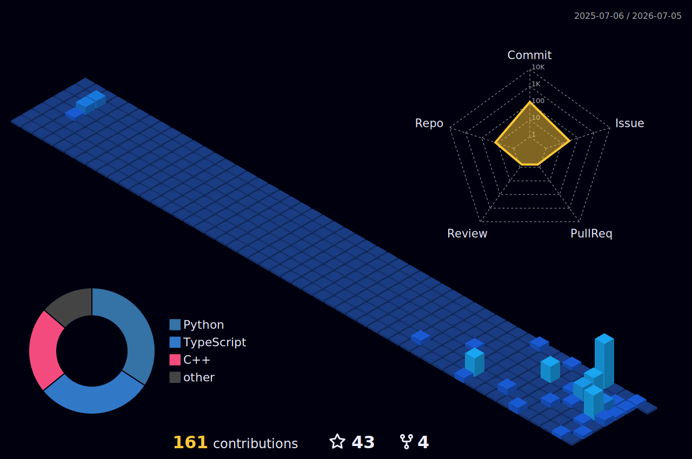

<h1 align="center">
  नमस्कार! I'm Aditya Khamitkar 🚀
</h1>

  

  

---

## 👨‍🔬 About Me

I am a researcher and engineer specializing in **Computational and Data Science**, with a strong focus on advanced machine learning, state-space models, and distributed systems. 

* 🧠 **Currently building:** Baby Dragon Hatchling (BDH), a novel scale-free state-space sequence-learning architecture using spiking neural networks.
* 🛰️ **Recent research:** Engineered AI radar signal-strength prediction systems for PSLV/SSLV atmospheric-interference detection at **ISRO (Satish Dhawan Space Centre)**.
* ⚡ **Industry focus:** Validating production-grade LLM pipelines, agentic workflows (LangGraph), and RLHF evaluation rubrics as an AI Training Specialist.
* 🔭 **Interests:** Lunar SAR Polarimetry, Spiking Neural Networks, Big Data ETL, and Mechanistic Interpretability.

---

## 🚀 Featured Research & Projects

| Project | Description | Tech Stack |
|---------|-------------|------------|
| **Project Aether** | Enhancing Chandrayaan-1 & 2 SAR data to characterize subsurface water-ice using GPU-accelerated GAN pipelines (40% SNR improvement). | `PyTorch` `GANs` `SAR Processing` |
| **BDH** | Designing a biologically-inspired State-Space LLM architecture targeting monosemanticity without post-hoc analysis. | `Spiking NNs` `Hebbian Learning` |
| **Nexus Scout** | Architected an AI talent orchestrator using routing logic between personas with chunked batch inference on Llama-3.3. | `LangGraph` `Groq API` `Streamlit` |
| **AgriSat AI** | Built a scalable, distributed big-data ETL pipeline over multi-spectral satellite imagery. | `Apache Spark` `AWS S3` `Scikit-learn` |

---

## 🛠️ Technical Arsenal

### AI, ML & Data Engineering

  
  
  
  
  
  

### Languages & Core Tools

  
  
  
  
  
  

---

## 📊 GitHub Analytics

  

 

  

<b>🔥 Click to expand 3D & Advanced Contribution Graphs</b>

 

---

### 🤝 Let's Connect

