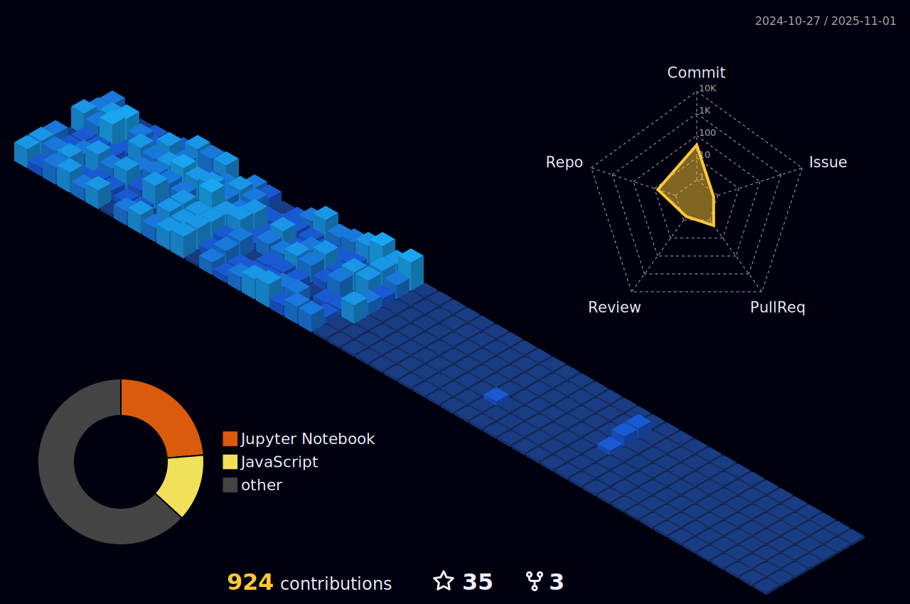

<h1 align="center">
  नमस्कार:! I'm Aditya Khamitkar!
</h1>

<!-- Typing SVG by DenverCoder1 - https://github.com/DenverCoder1/readme-typing-svg -->

   

  

<blockquote align="center">
  
मा कदापि त्यज

</blockquote>

## 🙋‍♂️ Connect with me

<!-- Badges template - https://github.com/badges/shields -->

  
  
  
  
  

  
## GitHub Stats

<!-- STREAKS and STATS -->

  
  

<!-- GitHub Activity Graph for Commits -->

  

## Contribution Graphs

<!-- 3D Contribution Graph -->

<!-- GitHub Activity Graph -->

<!-- Some badges are from https://github.com/Ileriayo/markdown-badges -->

## 🛠️ My favorite tools

### 👨‍💻 Programming languages

    
    
    
    

<!-- ### 🛠️ -->

### 🧰 Frameworks and libraries

    
    
    
    
    
    
    
    
    
    
    

### 🗄️ Databases, cloud hosting and deployment

    

💻 Software and tools

    
    
    

🪟 Operating Systems

    
    
    
    

  

